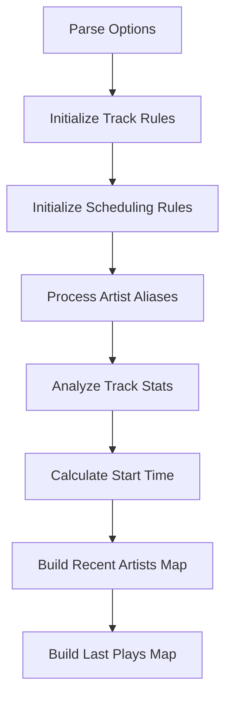
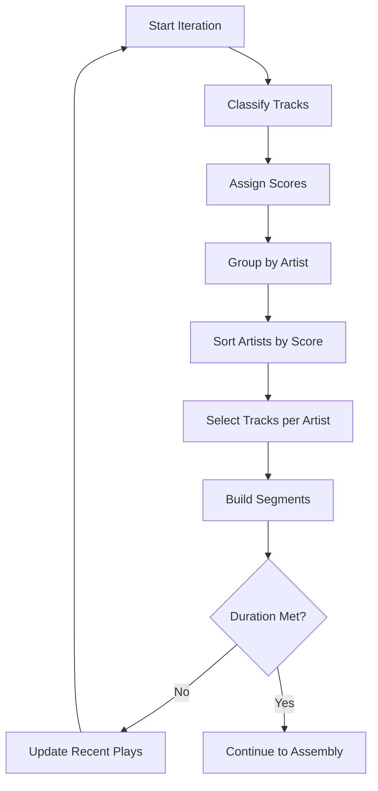
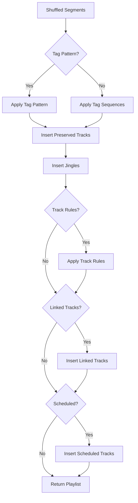

# StationAdmin.js Shuffle Algorithm Documentation

**Version:** 3.0.12  
**Last Updated:** 31.01.2026  
**File:** [`src/main/javascript/shuffle/StationAdmin.js`](../../../src/main/javascript/shuffle/StationAdmin.js)

## Overview

The StationAdmin shuffle algorithm is a sophisticated playlist generation system designed for radio station automation. It creates intelligent playlists by considering artist separation, tag weights, scheduling rules, jingle insertion, news breaks, ad triggers, and various other broadcasting requirements.

## Function Signature

```javascript
function(tracks, opts, trackStats)
```

The function is an IIFE (Immediately Invoked Function Expression) that takes three parameters and returns an array of shuffled tracks.

---

## Input Parameters

### 1. `tracks` (Array)

An array of track objects representing the available content for playlist generation.

#### Track Object Structure

```javascript
{
  id: Number,              // Unique track identifier
  type: String,            // Track type: 'song', 'jingle', 'moderation', 'news'
  title: String,           // Track title
  artist: String,          // Artist name (null for non-music tracks)
  album: String,           // Album name (optional)
  duration: Number,        // Track duration in seconds
  tags: Array<String>,     // Array of tag strings for categorization
  
  // Runtime properties (added by algorithm)
  score: Number,           // Calculated selection priority score
  use: Boolean,            // Whether track is selected for use
  plays: Number,           // Number of times track appears in playlist
  penalty: Number,         // Penalty score for recent plays
  artistNormalized: String,// Normalized artist name
  normTitle: String,       // Normalized title (if trackNameLimit > 0)
  groupTags: Array<String>,// Tags starting with "=" plus normalized title
  boundTo: Array<Number>,  // Indices of applicable track rules
  linked: Boolean          // Whether track is linked to previous/next track
}
```

#### Track Types

- **`song`**: Regular music tracks
- **`jingle`**: Station identification, promotional clips
- **`moderation`**: Voice tracks, announcements
- **`news`**: News bulletins (typically id=1)

#### Special Track Identifiers

- **News Track**: `id: 1` or `type: 'news'`
- **Ad Trigger**: Track with `title` or `artist` containing `'START_AD_BREAK'`, or `id: 0`, or `id: opts.adTrigger`
- **Ad Separator**: `id: opts.adSeparator`
- **Exclude Following Marker**: `id: 8664493` (excludes all subsequent tracks)

#### Tag System

Tags are strings used for categorization and scheduling:

- **Date Tags**: Format `@DD.MM.` or `@DD.MM. - DD.MM.` (e.g., `@24.12.`, `@01.12. - 24.12.`)
  - Tracks are included/excluded based on current date
  - Date ranges can wrap across year boundaries
  
- **Group Tags**: Start with `=` (e.g., `=rock`, `=ballad`)
  - Used for track name limiting to avoid similar tracks
  
- **Pattern Tags**: Any tag used in `opts.tagPattern`
  - Used for structured playlist generation
  
- **Selector Tags**: Tags referenced in `opts.scheduled` rules
  - Used for time-based track selection

---

### 2. `opts` (Object)

Configuration object controlling the shuffle algorithm behavior.

#### Core Options

| Option | Type | Default | Description |
|--------|------|---------|-------------|
| `duration` | Number | `64800` | Playlist duration in seconds (18 hours) |
| `blockLength` | Number | `(duration/3600)+1` | Length of each iteration block in hours |
| `maxTracksPerArtist` | Number | `floor(duration/3600)` | Maximum tracks per artist per block |
| `debug` | Boolean | `false` | Enable console logging for debugging |

#### Tag & Weight Options

| Option | Type | Default | Description |
|--------|------|---------|-------------|
| `tagWeights` | Object | `null` | Tag-to-weight mapping for track scoring |
| `tagPattern` | Array<String> | `[]` | Ordered pattern of tags/types for structured playlists |
| `tagSequences` | Array<Object> | `[]` | Rules for tag sequence enforcement |

**Tag Weights:**
- Positive weights (1-3): Prefer tracks with these tags (lower score)
- Negative weights (-1 to -3): Avoid tracks with these tags (higher score)
- Weight -4 or less: Exclude tracks completely
- Multiple tags: Uses max positive + min negative weight

**Tag Sequences:**
```javascript
{
  pattern: Array<String>,  // Sequence of tags to match
  next: String,           // Tag that should follow the pattern
  not: Boolean,           // If true, next tag should NOT be present
  index: Number           // Current position in pattern (runtime)
}
```

#### Artist Handling

| Option | Type | Default | Description |
|--------|------|---------|-------------|
| `artistSeparators` | Array<String> | `[' feat']` | Strings to split artist names (e.g., featuring) |
| `artistAliases` | Object | `null` | Map of artist name aliases (case-insensitive) |
| `avoidRepeat` | Number | `2` | Hours to avoid repeating tracks |
| `excludePreviousTracks` | Boolean | `false` | Completely exclude recently played tracks |
| `trackNameLimit` | Number | `0` | Number of recent tracks to check for similar titles (0=disabled) |

#### Jingle Options

| Option | Type | Default | Description |
|--------|------|---------|-------------|
| `jingleOrder` | String | `'shuffle'` | Jingle ordering: `'shuffle'`, `'shuffle_repeat'`, `'preserve'` |
| `jingleInterval` | Number | `0` | Minutes between jingles (0=auto-calculate) |
| `preserveAllJingles` | Boolean | `false` | Keep jingles in original positions |
| `protectFirstJingle` | Boolean | `false` | Prevent first jingle from being removed |
| `firstJingleAfterNews` | Boolean | `true` | Insert jingle after news breaks |

#### Moderation/Word Track Options

| Option | Type | Default | Description |
|--------|------|---------|-------------|
| `wordDistribution` | String | `'random'` | How to handle moderation tracks |

**Word Distribution Modes:**
- `'random'`: Shuffle moderation tracks with songs
- `'preserve'`: Keep moderation tracks in original positions
- `'link_next'`: Link moderation to following track
- `'link_previous'`: Link moderation to previous track

#### News Options

| Option | Type | Default | Description |
|--------|------|---------|-------------|
| `newsInterval` | Number | `60` | Minutes between news breaks |
| `newsMin` | Number | `59` | Start minute of news time window |
| `newsMax` | Number | `15` | End minute of news time window |
| `firstJingleAfterNews` | Boolean | `true` | Insert jingle after news |

**News Time Window:**
- If `newsMax > newsMin`: Window is `newsMin` to `newsMax` (e.g., 0-15 or 30-45)
- If `newsMax < newsMin`: Window wraps hour (e.g., 59-15 means :59 to :15)

#### Ad Trigger Options

| Option | Type | Default | Description |
|--------|------|---------|-------------|
| `adTrigger` | Number | `null` | Track ID for ad trigger |
| `adSeparator` | Number | `null` | Track ID for ad separator (played before trigger) |
| `adPositions` | Array<Number> | `[15, 45]` | Minutes past hour for ad breaks |
| `adJingleCollisionStrategy` | String | `'keep_both'` | How to handle ad/jingle conflicts |

**Ad Jingle Collision Strategies:**
- `'keep_both'`: Keep both ad trigger and jingle
- `'move_adtrigger'`: Delay ad trigger by 60 seconds (max 2 times)
- `'remove_jingle'`: Remove conflicting jingles

#### Track Rules Options

Track rules allow binding specific tracks to other tracks based on filters.

| Option | Type | Default | Description |
|--------|------|---------|-------------|
| `trackRules` | Array<Object> | `undefined` | Array of track rule definitions |
| `trackRuleGroups` | Object | `{}` | Named groups for track rules |
| `trackRuleJingleCollisionStrategy` | String | `'keep_both'` | Collision handling for rule jingles |
| `trackRuleGroupCollisionStrategy` | String | `'all'` | How to handle multiple group matches |

**Track Rule Object:**
```javascript
{
  trackId: Number,        // ID of track to insert
  filterType: String,     // 'tag', 'artist', 'title', 'artist_title'
  filter: String,         // Filter value (tag name or search term)
  position: String,       // 'before' or 'after'
  minDistance: Number,    // Minimum minutes between applications
  groupName: String,      // Optional group name
  
  // Runtime properties
  active: Boolean,        // Whether bound track exists
  lastPlay: Number,       // Timestamp of last application
  term: String           // Normalized filter term (runtime)
}
```

**Track Rule Groups:**
```javascript
{
  groupName: {
    minDistance: Number,        // Minimum minutes between any rule in group
    multiMatchSelection: String, // 'all', 'first', 'any'
    lastPlay: Number            // Timestamp of last group application (runtime)
  }
}
```

#### Scheduling Rules Options

Scheduling rules allow time-based track insertion.

| Option | Type | Default | Description |
|--------|------|---------|-------------|
| `scheduled` | Array<Object> | `undefined` | Array of scheduling rule definitions |

**Scheduling Rule Object:**
```javascript
{
  tag: String,            // Tag to select tracks (or special selector)
  selection: String,      // Selection mode (see below)
  minute: Number,         // Minute of hour to schedule
  hour: Number,           // Hour to schedule (optional, see special values)
  interval: Number,       // Hour interval (optional)
  day: Number,            // Day filter (optional, see special values)
  index: Number,          // Track index for 'index' selection mode
  introJingleId: Number,  // Optional jingle to play before track
  exclude: Boolean,       // If true, exclude tracks with this tag from random selection
  
  // Runtime properties
  tracks: Array<Object>,  // Tracks matching the tag (populated at runtime)
  trackIdxs: Array<Number>, // Original indices of matching tracks
  timeTracks: Array<Object> // For 'time' selection mode (runtime)
}
```

**Selection Modes:**
- `'random'`: Random track from matching tracks (default)
- `'rotate'`: Rotate through tracks based on last play time
- `'calculatedaily'`: Select based on day number modulo track count
- `'date'`: Match track title/album containing current date (DD.MM.)
- `'time'`: Match track title/album containing current hour (0-23)
- `'index'`: Use specific track index (1-based)

**Special Hour Values:**
- `-1`: Every hour (use with `interval`)
- `-2`: Random hour within playlist duration
- `-3`: Before news
- `-4`: After news

**Special Day Values:**
- `-1`: Every day (default)
- `-2`: Weekdays (Monday-Friday)
- `-3`: Weekend (Saturday-Sunday)
- `0-6`: Specific day (0=Sunday, 6=Saturday)

**Interval Behavior:**
- Positive: Hour interval (e.g., `2` = every 2 hours)
- `0`: Every hour
- Negative: Minute interval within each hour (e.g., `-15` = every 15 minutes)

---

### 3. `trackStats` (Array or null)

Historical play statistics for tracks, used to refine timing and avoid recent plays.

#### TrackStats Object Structure

```javascript
{
  id: Number,              // Track ID
  started_at: String,      // ISO 8601 timestamp when track started
  ends_at: String,         // ISO 8601 timestamp when track ends
  type: String,            // Track type
  artist: {                // Artist object (null for non-music)
    name: String          // Artist name
  }
}
```

#### Usage

- **Timing Refinement**: Last track's `ends_at` determines playlist start time
- **Recent Artist Tracking**: Last 12 tracks with artists are marked as recent
- **Repeat Avoidance**: Tracks played within `avoidRepeat` hours receive penalties
- **Jingle Timing**: Last jingle play time influences jingle distribution
- **Track Rule History**: Updates `lastPlay` for track rules
- **News Timing**: Tracks last news broadcast time

---

## Output

### Return Value

**Type:** `Array<Object>`

An array of track objects representing the generated playlist, in playback order.

#### Output Track Properties

Each track in the output array contains:
- All original properties from the input `tracks` array
- Additional runtime properties added during processing:
  - `score`: Selection priority score
  - `use`: Selection flag
  - `plays`: Number of times track appears
  - `penalty`: Penalty for recent plays
  - `artistNormalized`: Normalized artist name
  - `normTitle`: Normalized title (if applicable)
  - `groupTags`: Group tags for similarity checking
  - `boundTo`: Applicable track rule indices
  - `linked`: Link flag for connected tracks

#### Playlist Characteristics

The output playlist will have:
- **Duration**: Approximately matches `opts.duration` (may be slightly longer)
- **Artist Separation**: Artists separated according to `maxTracksPerArtist` and block structure
- **Jingles**: Inserted at regular intervals (if present)
- **News**: Scheduled at appropriate times (if news track present)
- **Ad Triggers**: Inserted at specified positions (if configured)
- **Scheduled Tracks**: Time-based tracks inserted per scheduling rules
- **Track Rules**: Bound tracks inserted before/after matching tracks
- **Linked Tracks**: Moderation tracks linked to songs (if configured)

---

## Algorithm Flow

### 1. Initialization Phase



**Key Actions:**
- Parse and validate all options with defaults
- Build lookup structures for track rules and scheduling
- Process track statistics to determine:
  - Playlist start time (based on last track end)
  - Recently played artists (last 12 tracks)
  - Recently played tracks (within `avoidRepeat` window)
  - Last jingle play time
  - Last news broadcast time
  - Track rule application history

### 2. Track Selection Phase

Iterative process that builds the playlist in blocks:



**Track Classification:**
- **News**: Extracted for scheduling
- **Ad Triggers**: Extracted for ad break scheduling
- **Jingles**: Collected for insertion (unless preserved)
- **Preserved Tracks**: Kept in original positions (if `preserveAllJingles` or `wordDistribution='preserve'`)
- **Bound Tracks**: Extracted for track rule application
- **Scheduled Tracks**: Collected for time-based insertion
- **Regular Tracks**: Available for shuffling

**Scoring System:**
- Base score: Random value 100-600
- Tag weight adjustment: ±75% based on tag weights
- Date tag exclusion: Score 999999 if outside date range
- Recent play penalty: +0 to +500 based on time since last play
- Tracks with score > 10000 are excluded

**Artist Grouping:**
- Tracks grouped by normalized artist name
- Artist separators applied (e.g., "feat" splits)
- Artist aliases resolved
- Artists sorted by lowest track score
- Up to `maxTracksPerArtist` tracks selected per artist

**Segment Building:**
- Playlist divided into `maxTracksPerArtist * 2` segments
- Artists distributed across segments to maximize separation
- Recent artists start from segment 1 (not 0) for better separation
- Segments filled to target duration

### 3. Playlist Assembly Phase



**Tag Pattern Application:**
- If `tagPattern` is defined, creates structured playlist
- Follows pattern cyclically (e.g., `['song', 'jingle', 'song', 'song']`)
- Enforces artist blocking (1 hour separation)
- Applies tag sequence rules
- Checks track name similarity (if `trackNameLimit` > 0)
- Allows track reuse if needed to fill duration

**Tag Sequence Application:**
- Enforces tag sequence rules without tag pattern
- Swaps tracks within 5-position window to satisfy rules
- Checks track name similarity

**Preserved Track Insertion:**
- Reinserts tracks at original positions
- Used for jingles (if `preserveAllJingles`) or moderation (if `wordDistribution='preserve'`)

**Jingle Insertion:**
- Calculates jingle interval (auto or manual)
- Determines first jingle offset
- Inserts jingles at regular intervals
- Handles jingle ordering (shuffle, shuffle_repeat, preserve)

**Track Rule Application:**
- Checks each track against active track rules
- Filters rules by time constraints (minDistance)
- Handles rule group conflicts
- Inserts bound tracks before/after matching tracks
- Manages jingle collisions per strategy

**Linked Track Insertion:**
- Inserts moderation tracks linked to songs
- Links can be before (`link_next`) or after (`link_previous`)
- Sets `linked` flag on connected tracks

**Scheduled Track Insertion:**
- Schedules news breaks at appropriate times
- Schedules ad triggers at specified positions
- Schedules rule-based tracks at specified times
- Sorts all scheduled elements by time
- Inserts scheduled tracks at appropriate positions
- Handles jingle collisions per strategy
- May delay insertion if timing conflicts occur

### 4. Scheduling Details

**News Scheduling:**
- Checks if start time is in news window
- Schedules news at `newsInterval` intervals
- Inserts pre-news jingle (if configured)
- Inserts post-news jingle (if `firstJingleAfterNews`)
- Avoids news in last 15 minutes of playlist
- Minimum 45 minutes between news breaks

**Ad Trigger Scheduling:**
- Schedules at `adPositions` minutes past each hour
- Validates position spacing (20-40 minutes apart)
- Inserts ad separator before trigger (if configured)
- Alternates between two positions each hour

**Rule-Based Scheduling:**
- Processes each scheduling rule
- Determines applicable hours based on `hour` and `interval`
- Filters by day of week (if specified)
- Selects tracks based on selection mode
- Schedules intro jingle (if specified)
- Creates scheduled elements with time windows

**Scheduled Element Structure:**
```javascript
{
  tracks: Array<Object>,   // Tracks to insert
  minTime: Number,         // Earliest insertion time (timestamp)
  maxTime: Number,         // Latest insertion time (timestamp)
  jingleCollision: String, // Collision handling strategy
  type: String            // 'news', 'adTrigger', or 'rule'
}
```

---

## Special Features

### Date-Based Track Filtering

Tracks can be included/excluded based on date tags:

**Format:** `@DD.MM.` or `@DD.MM. - DD.MM.`

**Examples:**
- `@24.12.` - Only on December 24th
- `@01.12. - 24.12.` - December 1st through 24th
- `@15.11. - 15.01.` - November 15th through January 15th (wraps year)

**Behavior:**
- Date ranges can wrap across year boundaries
- Tracks with date tags outside current date receive score 999999 (excluded)
- Multiple date tags: If any tag excludes (state=-1), track is excluded

### Track Name Limiting

Prevents similar tracks from playing too close together:

**Configuration:** `opts.trackNameLimit = N` (number of recent tracks to check)

**Mechanism:**
- Normalizes track titles (removes non-word characters)
- Includes group tags (tags starting with `=`)
- Maintains sliding window of recent track names
- Adds penalty (+3) if any group tag matches recent tracks
- Works with both tag pattern and tag sequence modes

### Artist Normalization

**Process:**
1. Convert to lowercase
2. Apply artist aliases (if configured)
3. Split on artist separators (e.g., " feat")
4. Take first part only
5. Apply aliases again (in case separator revealed alias)

**Example:**
```javascript
// Input: "Taylor Swift feat. Ed Sheeran"
// Separator: " feat"
// Output: "taylor swift"
```

### Customization Hooks

Two empty functions are provided for custom extensions:

```javascript
function customScheduledElementCreate(rule, trackIdx, scheduledElement) {}
function customInitialize() {}
```

These can be overridden to add custom behavior without modifying core algorithm.

---

## Usage Examples

### Example 1: Basic Shuffle

```javascript
const tracks = [
  { id: 1, type: 'song', title: 'Song 1', artist: 'Artist A', duration: 180, tags: [] },
  { id: 2, type: 'song', title: 'Song 2', artist: 'Artist B', duration: 200, tags: [] },
  { id: 3, type: 'jingle', title: 'Station ID', artist: null, duration: 10, tags: [] }
];

const opts = {
  duration: 3600,  // 1 hour
  avoidRepeat: 2
};

const playlist = shuffleFunction(tracks, opts, null);
```

### Example 2: Tag Weights

```javascript
const opts = {
  duration: 7200,
  tagWeights: {
    'rock': 2,        // Prefer rock
    'ballad': -1,     // Avoid ballads
    'explicit': -4    // Exclude explicit content
  }
};
```

### Example 3: Tag Pattern

```javascript
const opts = {
  duration: 3600,
  tagPattern: ['song', 'song', 'jingle', 'song'],  // 2 songs, jingle, 1 song, repeat
  tagWeights: {
    'upbeat': 1,
    'slow': -1
  }
};
```

### Example 4: Scheduling Rules

```javascript
const opts = {
  duration: 14400,  // 4 hours
  scheduled: [
    {
      tag: 'hourly_promo',
      selection: 'rotate',
      minute: 30,
      interval: 1  // Every hour at :30
    },
    {
      tag: 'morning_show',
      selection: 'index',
      index: 1,
      hour: 8,
      minute: 0
    },
    {
      tag: 'weather',
      selection: 'random',
      hour: -3,  // Before news
      minute: 0
    }
  ]
};
```

### Example 5: Track Rules

```javascript
const opts = {
  duration: 7200,
  trackRules: [
    {
      trackId: 999,           // Jingle ID
      filterType: 'artist',
      filter: 'Taylor Swift',
      position: 'before',
      minDistance: 60,        // At least 60 minutes between applications
      groupName: 'artist_intros'
    }
  ],
  trackRuleGroups: {
    'artist_intros': {
      minDistance: 30,
      multiMatchSelection: 'first'
    }
  },
  trackRuleJingleCollisionStrategy: 'keep_rule_jingle'
};
```

### Example 6: News and Ads

```javascript
const opts = {
  duration: 10800,  // 3 hours
  newsInterval: 60,
  newsMin: 59,
  newsMax: 5,       // News window: :59 to :05
  firstJingleAfterNews: true,
  adPositions: [15, 45],
  adTrigger: 12345,  // Track ID for ad trigger
  adSeparator: 12346,
  adJingleCollisionStrategy: 'move_adtrigger'
};
```

### Example 7: Complete Configuration

```javascript
const tracks = [...];  // Full track list
const trackStats = [...];  // Recent play history

const opts = {
  // Core
  duration: 64800,  // 18 hours
  blockLength: 6,
  maxTracksPerArtist: 18,
  
  // Tags
  tagWeights: {
    'rock': 2,
    'pop': 1,
    'slow': -1,
    'explicit': -4
  },
  tagPattern: [],
  tagSequences: [
    {
      pattern: ['upbeat', 'upbeat'],
      next: 'slow',
      not: false
    }
  ],
  
  // Artists
  artistSeparators: [' feat', ' ft.', ' featuring'],
  artistAliases: {
    'p!nk': 'pink',
    'ke$ha': 'kesha'
  },
  avoidRepeat: 3,
  trackNameLimit: 5,
  
  // Jingles
  jingleOrder: 'shuffle_repeat',
  jingleInterval: 12,
  preserveAllJingles: false,
  protectFirstJingle: true,
  
  // Moderation
  wordDistribution: 'link_previous',
  
  // News
  newsInterval: 60,
  newsMin: 59,
  newsMax: 15,
  firstJingleAfterNews: true,
  
  // Ads
  adTrigger: 10001,
  adSeparator: 10002,
  adPositions: [15, 45],
  adJingleCollisionStrategy: 'move_adtrigger',
  
  // Track Rules
  trackRules: [...],
  trackRuleGroups: {...},
  trackRuleJingleCollisionStrategy: 'keep_both',
  trackRuleGroupCollisionStrategy: 'all',
  
  // Scheduling
  scheduled: [...],
  
  // Debug
  debug: false
};

const playlist = shuffleFunction(tracks, opts, trackStats);
```

---

## Performance Considerations

### Iteration Limits

- Maximum 20 iterations to prevent infinite loops
- Each iteration processes one block (default: `blockLength` hours)
- Iterations continue until target duration is met

### Complexity

- **Track Selection**: O(n log n) per iteration (sorting)
- **Artist Grouping**: O(n) per iteration
- **Segment Building**: O(n) per iteration
- **Tag Pattern**: O(n × m) where m is pattern length
- **Track Rules**: O(n × r) where r is number of rules
- **Scheduling**: O(s log s) where s is number of scheduled elements

### Memory Usage

- Maintains multiple track indices and lookup maps
- Duplicates tracks in output if reused (tag pattern mode)
- Stores historical data for recent plays and artists

---

## Debugging

Enable debug mode to see console output:

```javascript
const opts = {
  duration: 3600,
  debug: true
};
```

**Debug Output Includes:**
- Scheduling decisions with timestamps
- Track selection for scheduled rules
- Scheduled element insertion timing
- Tag pattern matching details

---

## Version History

### v3.0.12 (31.01.2026)
- Current version
- Includes all features documented above

---

## Related Files

- **Configuration**: [`src/main/resources/shufflescripts.json`](../../../src/main/resources/shufflescripts.json)
- **Other Algorithms**: 
  - [`src/main/javascript/shuffle/BlockSelect_v1.js`](../../../src/main/javascript/shuffle/BlockSelect_v1.js)
  - [`src/main/javascript/shuffle/Resume.js`](../../../src/main/javascript/shuffle/Resume.js)

---

## Notes

- This algorithm is deployed to the laut.fm server and runs server-side
- No local build or test tools are available for JavaScript shuffle scripts
- The algorithm is designed for 24/7 radio station automation
- All times are handled in milliseconds (JavaScript timestamps)
- The algorithm is stateless between invocations (relies on `trackStats` for history)
